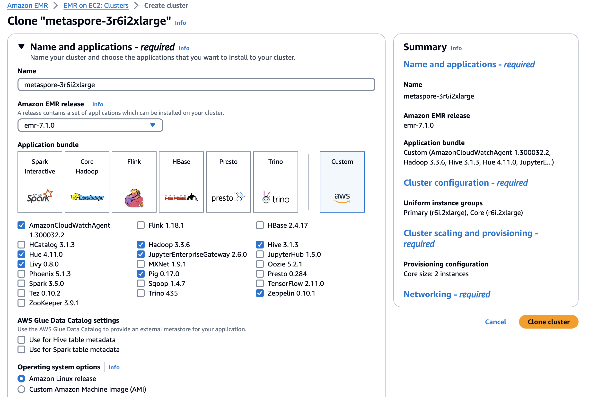
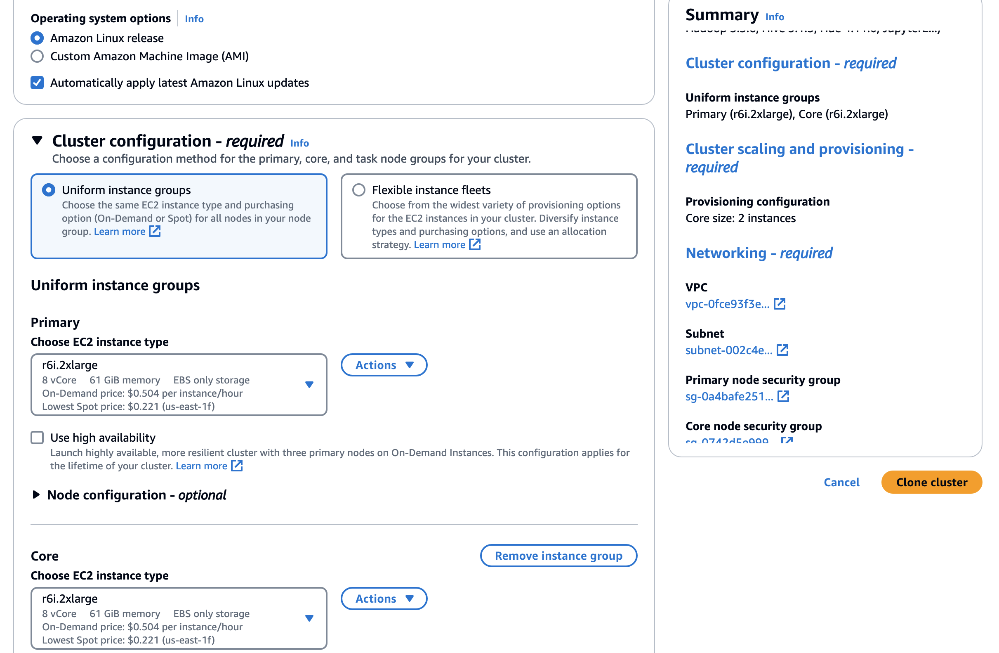
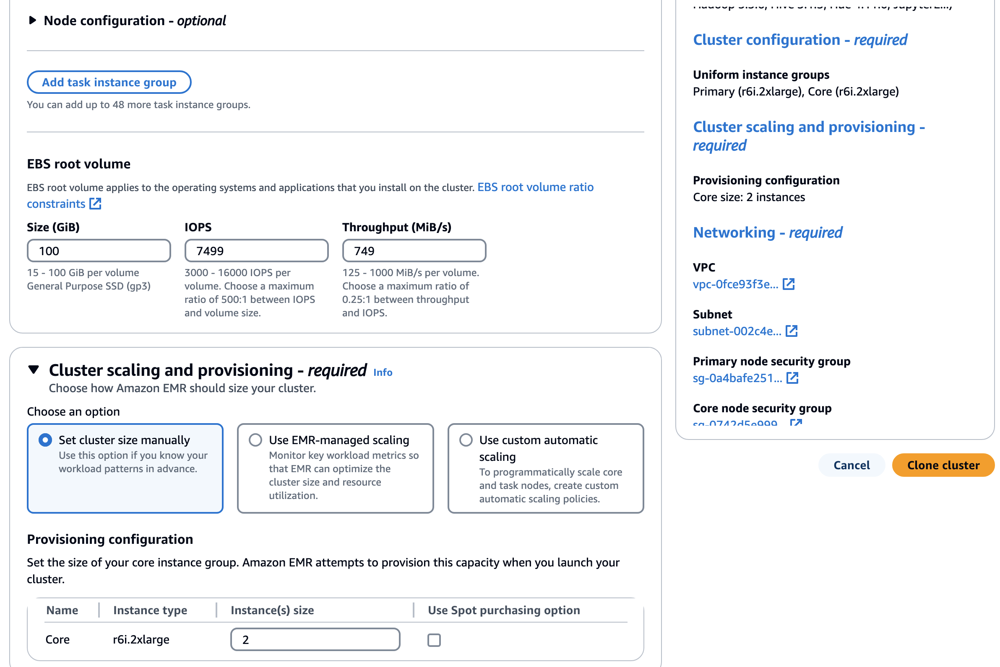
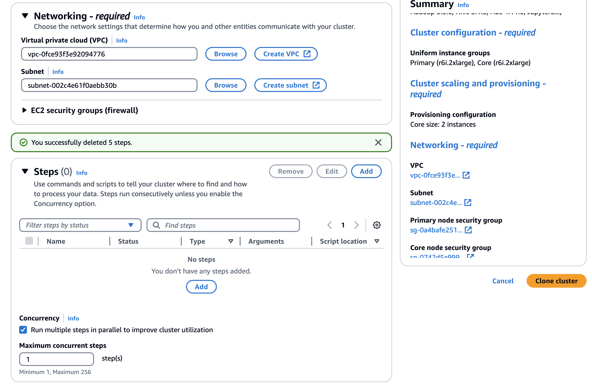
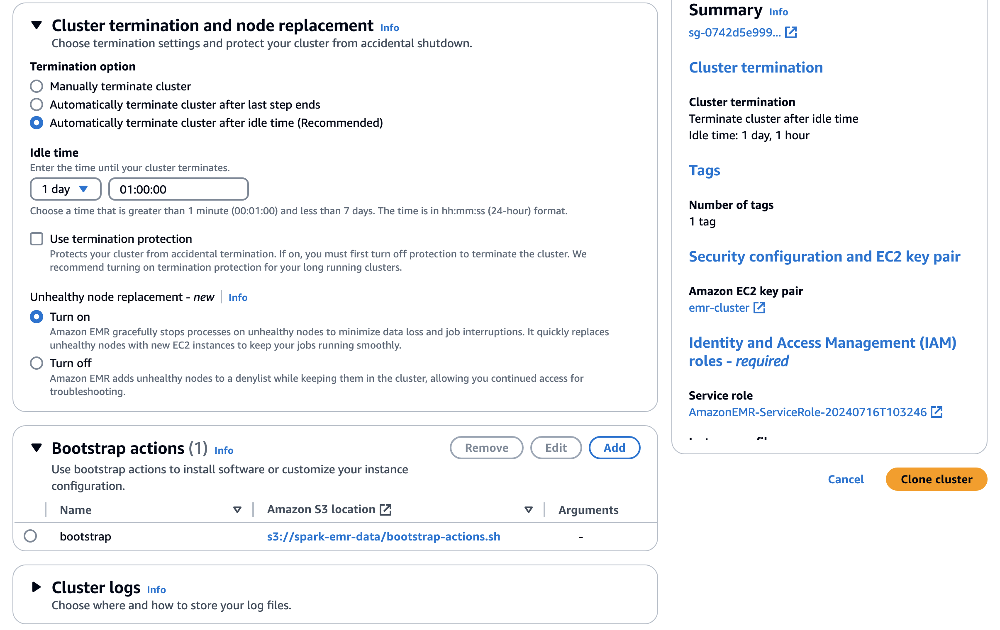
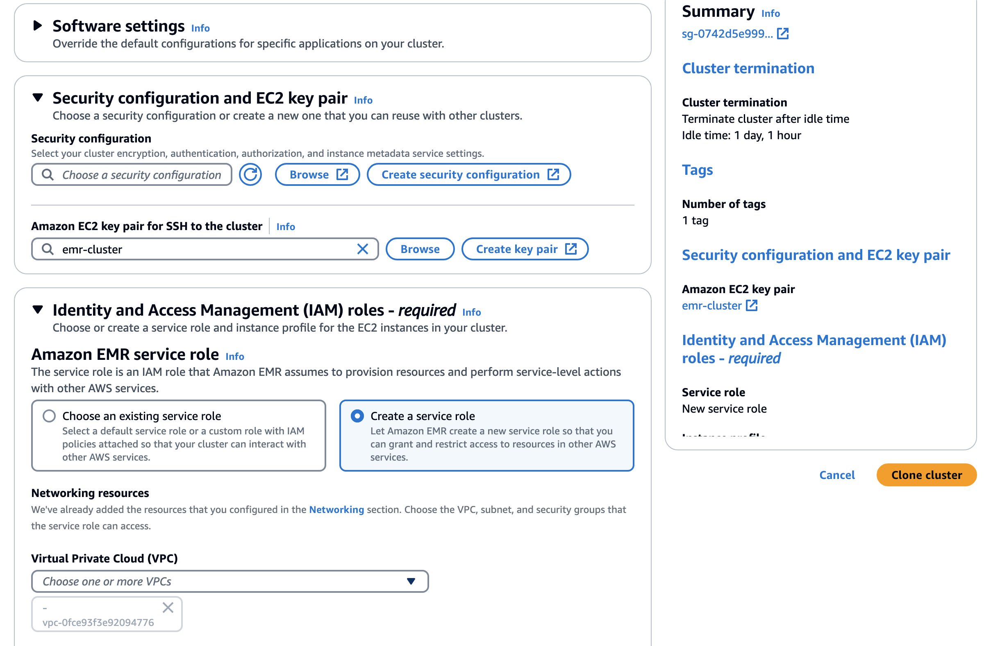
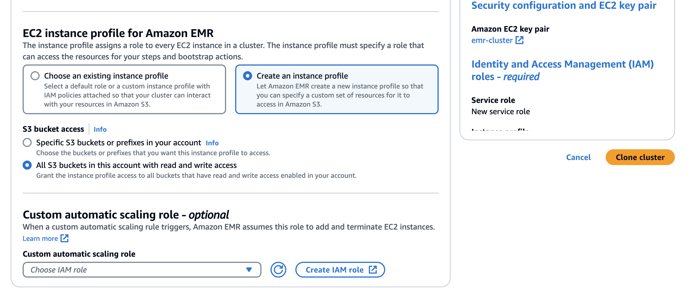

# Recompile metaspore
Suggest to use Ubuntu 20.04

## Step 1: Install the previous metaspore

### 离线安装包
我们提供了预编译的 Python 安装包，可以通过 pip 安装：
```bash
pip install metaspore
```
支持 Python 的最低版本为 3.8。

运行 MetaSpore 离线训练，还需要 PySpark 和 PyTorch。可以通过 `pip` 命令进行安装：
这两个依赖没有作为 metaspore wheel 的默认依赖，这样方便用户选择需要的版本。

Spark 官方打包的 PySpark，没有包含 hadoop-cloud 的 jar 包，无法访问 S3 等云存储。我们提供了一个打包好 S3 客户端的 [PySpark 安装包](https://ks3-cn-beijing.ksyuncs.com/dmetasoul-bucket/releases/spark/pyspark-3.1.2.265f9ad4ee-py2.py3-none-any.whl)，可以从这里下载后安装：
```bash
pip install https://ks3-cn-beijing.ksyuncs.com/dmetasoul-bucket/releases/spark/pyspark-3.1.2.265f9ad4ee-py2.py3-none-any.whl
```

```bash
pip install torch==1.11.0+cpu -f https://download.pytorch.org/whl/cpu/torch_stable.html
```

## Step 2:  Recompile the new metaspore

```bash
sudo apt install build-essential manpages-dev software-properties-common curl zip unzip tar pkg-config bison flex python3-dev

sudo add-apt-repository ppa:ubuntu-toolchain-r/test

sudo apt-get update

sudo apt install gcc-11 g++-11

# optional steps if you have multiple versions of gcc/g++
sudo update-alternatives --install /usr/bin/gcc gcc /usr/bin/gcc-9 90 --slave /usr/bin/g++ g++ /usr/bin/g++-9 --slave /usr/bin/gcov gcov /usr/bin/gcov-9 --slave /usr/bin/gcc-ar gcc-ar /usr/bin/gcc-ar-9 --slave /usr/bin/gcc-ranlib gcc-ranlib /usr/bin/gcc-ranlib-9

sudo update-alternatives --install /usr/bin/gcc gcc /usr/bin/gcc-11 110 --slave /usr/bin/g++ g++ /usr/bin/g++-11 --slave /usr/bin/gcov gcov /usr/bin/gcov-11 --slave /usr/bin/gcc-ar gcc-ar /usr/bin/gcc-ar-11 --slave /usr/bin/gcc-ranlib gcc-ranlib /usr/bin/gcc-ranlib-11

# install latest cmake
wget -O - https://apt.kitware.com/keys/kitware-archive-latest.asc 2>/dev/null | gpg --dearmor - | sudo tee /etc/apt/trusted.gpg.d/kitware.gpg >/dev/null
 
sudo apt-add-repository "deb https://apt.kitware.com/ubuntu/ $(lsb_release -cs) main" 

sudo apt update
sudo apt install cmake

# MetaSpore uses vcpkg to manage thirdparty c++ dependencies
git clone https://github.com/Microsoft/vcpkg.git ~/.vcpkg
~/.vcpkg/bootstrap-vcpkg.sh

# cd ~/.vcpkg/triplets

# create a ~/.vcpkg/triplets/x64-linux-custom.cmake with the following contents
# This is the issue which leads to undefined symbol or unreferenced symbol during link, D_GLIBCXX_USE_CXX11_ABI=0 should be used for all packages installed using vcpkg, since CMakeFiles.txt also used this.

cat <<EOF > ~/.vcpkg/triplets/x64-linux-custom.cmake
set(VCPKG_TARGET_ARCHITECTURE x64)
set(VCPKG_CRT_LINKAGE dynamic)
set(VCPKG_LIBRARY_LINKAGE static)
set(VCPKG_CXX_FLAGS "-D_GLIBCXX_USE_CXX11_ABI=0")
set(VCPKG_C_FLAGS "-D_GLIBCXX_USE_CXX11_ABI=0")
set(VCPKG_CMAKE_SYSTEM_NAME Linux)
EOF

git clone https://github.com/meta-soul/MetaSpore.git
cd MetaSpore

# Download MNIST dataset from s3
mkdir -p cpp/tests/data/MNIST
aws s3 sync s3://sagemaker-us-west-2-452145973879/datasets/MNIST/ cpp/tests/data/MNIST

mkdir build && cd build
cmake .. -DCMAKE_EXPORT_COMPILE_COMMANDS=ON -DCMAKE_BUILD_TYPE=Release -DCMAKE_TOOLCHAIN_FILE=~/.vcpkg/scripts/buildsystems/vcpkg.cmake -DVCPKG_TARGET_TRIPLET=x64-linux-custom -DBUILD_TRAIN_PKG=ON -DBUILD_SERVING_BIN=ON -DENABLE_TESTS=ON

make -j8

# Then install  
pip install metaspore-1.2.0-cp39-cp39-linux_x86_64.whl

# Then use the following code to test
python widedeep.py --conf conf/widedeep_ml_1m.yaml.dev
```

# Start an EMR Cluster
1. Change bootstrap-actions.sh, most importantly, change the required package s3 location when necessary.
2. Upload the bootstrap-actions.sh to an S3 location.
3. Follow the following configs to start EMR cluster, note to change core instance numbers, add bootstrap-actions.sh s3 location, you can create an Amazon EMR service role, EC2 instance profile for Amazon EMR in the first time, later can reuse: 










# Data Preprocessing

Used to split value and weights in advance, change previous 1 feature column into 2 columns, for instance, _11001 -> _11001, _11001_weight, where _11001 is value, _11001_weight is weight, both are Array Type. 

Option 1: In EMR console, add a step by setting:
Type: Custom JAR
Name: data_process
JAR location: command-runner.jar
Arguments: spark-submit --deploy-mode cluster --master yarn --driver-cores 1 /home/hadoop/data_process.py --worker-count 8 --server-count 4 --worker-cpu 1 --server-cpu 1 --worker-memory 6G --server-memory 6G --coordinator-memory 6G --num-files 100 --batch-size 1000 --spark-memory-fraction 0.1 --file-base-path hdfs:///user/hadoop/mv-mtg-di-for-poc-datalab/2024/06/14/00/ --output-format parquet --output-dir hdfs:///user/hadoop/data/parquets/2024/06/14/00/

Option 2: Use the following command when you sshed into the master EC2 node.
```bash
spark-submit --deploy-mode cluster --master yarn --driver-cores 1 /home/hadoop/data_process.py --worker-count 8 --server-count 4 --worker-cpu 1 --server-cpu 1 --worker-memory 6G --server-memory 6G --coordinator-memory 6G --num-files 100 --batch-size 1000 --spark-memory-fraction 0.1 --file-base-path hdfs:///user/hadoop/mv-mtg-di-for-poc-datalab/2024/06/14/00/ --output-format parquet --output-dir hdfs:///user/hadoop/data/parquets/2024/06/14/00/
```

You need to change the arguments, like file-base-path, output-format, output-dir, based on needs.

# Start Training

Still, have two options, add step in EMR console or ssh into master EC2 instance and submit task.

Option 1: In EMR console, add a step by setting:
Type: Custom JAR
Name: training
JAR location: command-runner.jar
Arguments: spark-submit --deploy-mode cluster --master yarn --driver-cores 1 /home/hadoop/train.py --worker-count 8 --server-count 4 --worker-cpu 1 --server-cpu 1 --worker-memory 6G --server-memory 6G --coordinator-memory 6G --num-files 200 --batch-size 1000 --spark-memory-fraction 0.1 --num-files 1 --data-format orc --file-base-path s3://spark-emr-data/processed/orcs/2024/06/14/

Option 2: Use the following command when you sshed into the master EC2 node.
```bash
spark-submit --deploy-mode cluster --master yarn --driver-cores 1 /home/hadoop/train.py --worker-count 8 --server-count 4 --worker-cpu 1 --server-cpu 1 --worker-memory 6G --server-memory 6G --coordinator-memory 6G --num-files 200 --batch-size 1000 --spark-memory-fraction 0.1 --num-files 1 --data-format orc --file-base-path s3://spark-emr-data/processed/orcs/2024/06/14/
```

# Analyze using Spark UI
Can use Spark UI to view the training process, on EMR console, Applications tab, there is a button named 'Enable an SSH connection', follow the steps there to configure Chrome proxy, and then can open the HDFS Name Node, Resource Manager, etc. links in Chrome.

